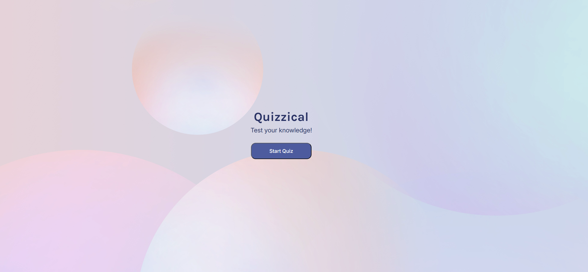

# Quizzical App

A lightweight quiz application built with React and Vite. The implementation and code are mine; the idea and visual design were inspired by the Scrimba Frontend Developer course.

## Demo / Screenshots
Preview screenshots from the running app (files are in `src/assets/`):




## Key features
- Fetches quiz questions from the Open Trivia Database (free public API).
- Error handling with fallback to local `mockData.js` when the API call fails or returns unexpected data.
- Component-separated code (e.g. `App.jsx`, `Quiz.jsx`) for clarity and maintainability.
- Decodes HTML entities in API responses using `html-entities` so questions and answers render correctly.
- Responsive layout using flexible sizing and flexbox (uses `clamp()` for fluid fonts and `flex-shrink` to avoid overflow).

## Tech stack
- React + JSX
- Vite (dev server + bundler)
- html-entities (decode API-provided HTML entities)
- Open Trivia Database (https://opentdb.com)

## Project structure (high level)
```
src/
	App.jsx          # app entry, routing and shared state
	main.jsx         # ReactDOM render
	Quiz.jsx         # quiz logic: fetch questions, handle UI state
	mockData.js      # fallback questions used when API fails
	index.css        # styles
	assets/          # images/screenshots
```

## Implemented behavior (details)

- API fetching
	- The app requests quiz questions from the Open Trivia Database (for example: `https://opentdb.com/api.php?amount=5&type=multiple`).
	- If the network request fails or the response is invalid, the app falls back to `mockData.js` so the UI remains usable offline.

- HTML entity decoding
	- Questions and answers from the API may contain HTML entities (e.g. `"`, `&`). These are decoded before rendering using the `html-entities` package.

- Component separation
	- UI and logic are split across components for readability and easier testing.

- Error handling & fallback data
	- Fetch errors are caught, a user-facing message can be shown, and local mock data is used as a fallback.

## Installation
Make sure you have Node.js and npm installed.

Install dependencies:

```bash
npm install
```

If `html-entities` is not already installed, add it:

```bash
npm install html-entities
```

## Run (development)

```bash
npm run dev
```

Open the app at the URL printed by Vite (commonly `http://localhost:5173`).

## Build

```bash
npm run build
```

## Verifying API and fallback behavior
1. Start the app with `npm run dev`.
2. With an internet connection the app should fetch questions from Open Trivia DB and display them.
3. To test fallback behavior:
	 - Temporarily block requests to `opentdb.com` in your browser, or
	 - Edit the API URL in `Quiz.jsx` to an invalid URL and reload — the app should use `mockData.js`.

## Notes & credits
- The visual design and project idea were inspired by the Scrimba Frontend Developer course; all code in this repository is authored by the project owner.
- Questions come from the Open Trivia Database (https://opentdb.com). Please review their usage terms for any production use.
